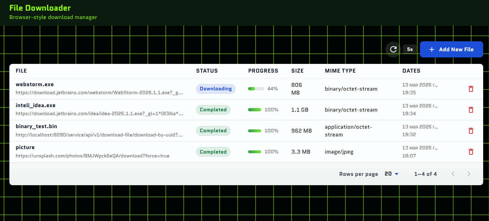
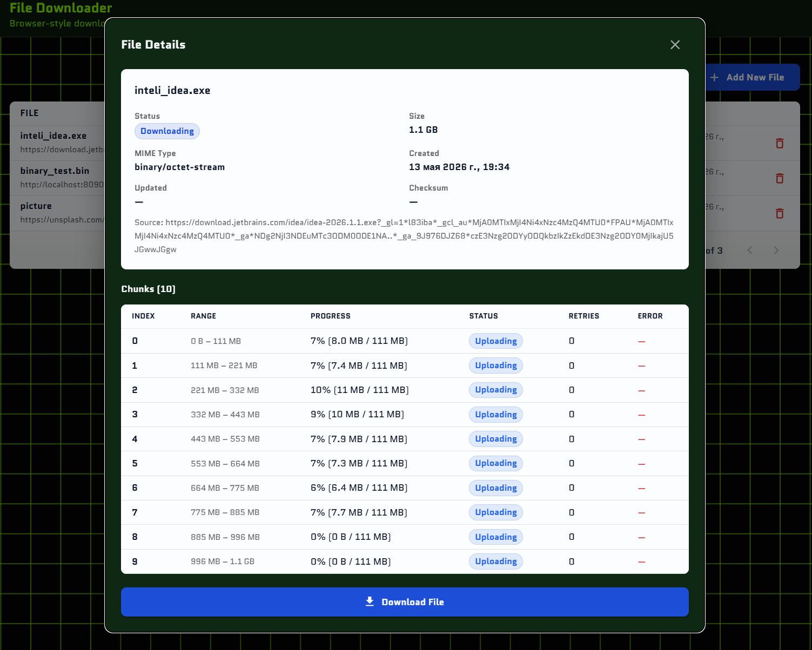
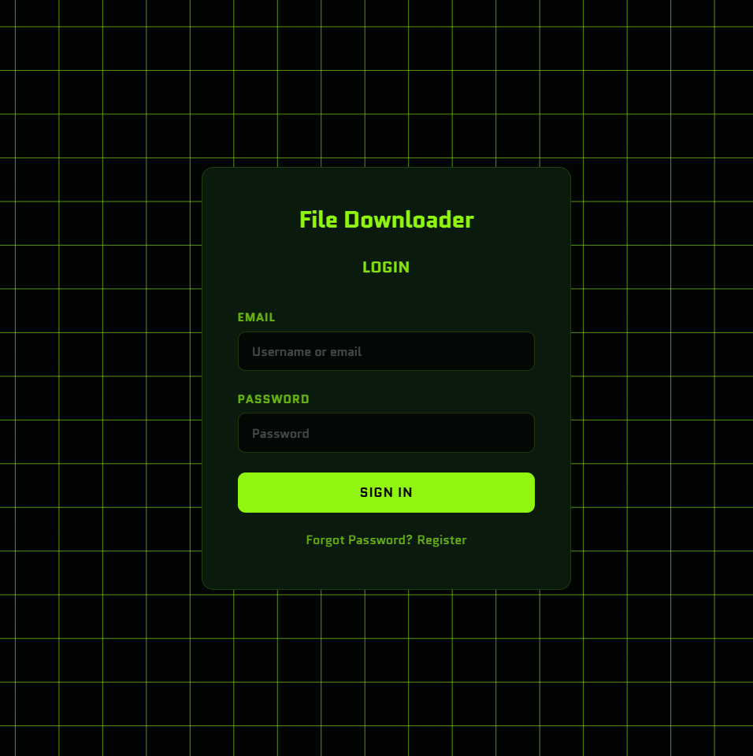

# File Downloader

A browser-style download manager with a web interface. Add download URLs, the system downloads files in parallel chunks, assembles them, and serves the completed file for download.

## Architecture

The project consists of two main parts:

### Frontend (`file-downloader-frontend`)

- **React 19** + **TypeScript 6** + **Vite 8**
- **Material UI 7** — UI components and styling
- **Redux Toolkit** + **RTK Query** — state management and API calls
- **React Router 7** — routing
- **openapi-typescript** — type generation from OpenAPI spec

### Backend (`file-downloader-backend`)

Microservice architecture built with **Spring Boot 4.0** (Java 21) + **Spring Cloud 2025.1.0**:

| Service | Port | Purpose |
|---------|------|---------|
| **config-service** | 8888 | Centralized configuration (Spring Cloud Config) |
| **discovery-service** | 8761 | Service registry (Eureka) |
| **api-gateway** | 8081 | Single entry point, routing, CORS, OAuth2 resource server |
| **downloader-service** | 8085 | Core logic: download management, chunks, file assembly |
| **Keycloak** | 8082 | Authentication and SSO (OAuth2 / OpenID Connect) |
| **PostgreSQL** | 5437 | Database (Docker) |
| **Keycloak PostgreSQL** | - | Keycloak database (Docker) |

## How It Works

1. User submits a file URL through the web interface
2. Backend sends a **HEAD request** to the source, determines file size and MIME type
3. The file is split into **10 chunks** (if the server supports Range requests)
4. Chunks are downloaded **in parallel** to `temporary-downloads/`
5. Once all chunks are complete, they are **assembled** into a single file in `ready-downloads/`
6. The completed file is available for download via the web interface

## Screenshots

### File List



Main screen showing all downloads with status badges, progress bars, and controls.

### File Details



Modal dialog with detailed file information, chunk list, and download button.

### Login



Custom Keycloak login page.

## Getting Started

### 1. Backend

```bash
# Start PostgreSQL, Keycloak, and other infrastructure
cd file-downloader-backend
docker compose up -d

# Start microservices (in order)
./mvnw spring-boot:run -pl config-service
./mvnw spring-boot:run -pl discovery-service
./mvnw spring-boot:run -pl api-gateway
./mvnw spring-boot:run -pl downloader-service
```

API Gateway will be available at `http://localhost:8081`.
Swagger UI: `http://localhost:8081/swagger-ui/index.html`
Keycloak Admin Console: `http://localhost:8082` (admin / admin)

### 2. Frontend

```bash
cd file-downloader-frontend
npm install
npm run dev
```

Frontend will be available at `http://localhost:5173`.  
The app automatically redirects to the Keycloak login page for authentication.

## API Endpoints

All requests go through the API Gateway (`http://localhost:8081`).

| Method | Path | Description |
|--------|------|-------------|
| `POST` | `/downloader-service/api/v1/file-description/all` | List files (with filtering and pagination) |
| `GET` | `/downloader-service/api/v1/file-description/{id}` | Get file details with chunks |
| `POST` | `/downloader-service/api/v1/file-description` | Create a new download |
| `DELETE` | `/downloader-service/api/v1/file-description/{id}` | Delete a download |
| `GET` | `/downloader-service/api/v1/file-description/{id}/download` | Download the assembled file |

## Tech Stack

**Frontend:** React, TypeScript, Vite, Material UI, Redux Toolkit, RTK Query, React Router, Zod, react-hook-form, keycloak-js

**Backend:** Java 21, Spring Boot 4.0, Spring Cloud 2025.1.0, Spring Data JPA, Spring Cloud Gateway, Eureka, MapStruct, Liquibase, PostgreSQL

**Auth:** Keycloak 26 (OAuth2 / OpenID Connect, PKCE flow, custom login theme)

**Infrastructure:** Docker, Docker Compose
